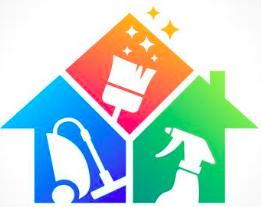
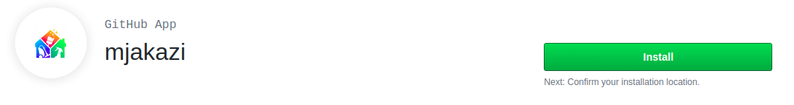
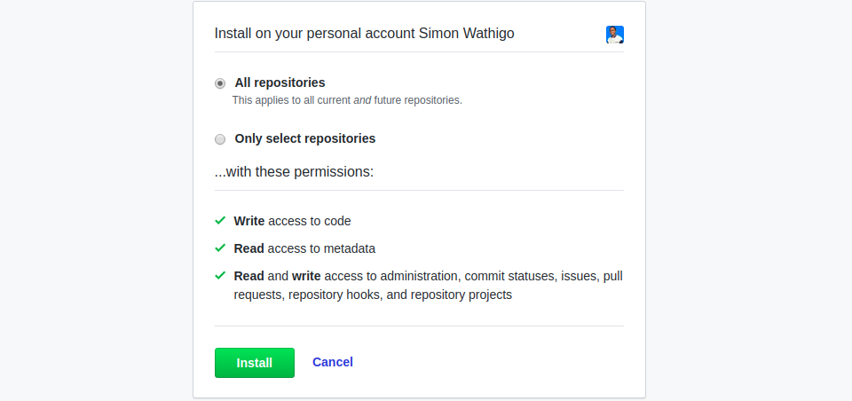
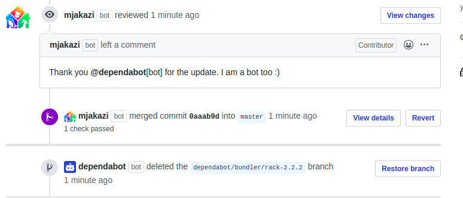

[](https://codeclimate.com/github/wathigo/house-keeper/maintainability)[](https://travis-ci.org/wathigo/house-keeper)
<p align="center">
  <a href="#">
    
  </a>

  <h3 align="center">House Keeper</h3>

  <p align="center">
    Ruby Project
    <br />
    <br />
    <a href="https://github.com/wathigo/house-keeper/issues">Report Bug</a>
    ·
    <a href="https://github.com/wathigo/house-keeper/issues">Request Feature</a>
  </p>
</p>


<!-- TABLE OF CONTENTS -->
## Table of Contents

* [About the Project](#about-the-project)
  * [Built With](#built-with)
  * [Getting Started](#getting-started)
* [Contact](#Contact)


<!-- ABOUT THE PROJECT -->
## About The Project
House Keeper is a [GitHub app](https://developer.github.com/v3/apps/) that subscribes to the following github [webhooks](https://developer.github.com/webhooks/) events:
1. [installation](https://developer.github.com/v3/activity/events/types/#installationevent). When `installation` webhook event of `created` action type is fired, the app fetches all the pull requests from allowed repository meeting the following conditions.
* Have a `status = 'opened'`
* Created by dependabot user.

2. [installation_repositories](https://developer.github.com/v3/activity/events/types/#installation_repositoriesevent). When `installation_repositories` webhook event of `added` action type is fired, the app through all the repos, fetches pull request that meets the conditions above, leaves a friendly comment and merges the branch.

3. [pull_request](https://developer.github.com/v3/activity/events/types/#pullrequestevent). When `pull_request` webhook event of `opened` action type is fired, the app leaved a comment and merges the pull request if the creator of the pull request is dependabot.

### Getting Started

Go to

```
https://github.com/apps/mjakazi
```
Click on install app



Choose the repositories



Watch all the repo containing pull requests opened by dependabot. You should see this



To test the application locally,
Clone the repository
``` 
git clone https://github.com/wathigo/house-keeper.git
```
Navigate to the root directory of the cloned repository
```
cd house-keeper
```
Install dependencies
```
bundle install
```
Run tests
```
bundle exec rspec
```


### ToDo
Merge the branch when all the checks are done. This is an issue opened [here]([issues page](../../issues/5).)

### Built With
* [Ruby](https://www.ruby-lang.org/en/)
* [Sinatra](http://sinatrarb.com/)
* [Octokit](https://github.com/octokit/octokit.rb)
* [GitHub Webhooks](https://developer.github.com/webhooks/)
* [GitHub apps](https://developer.github.com/apps/about-apps/)

### Contact
* [Simon Wathigo](https://github.com/wathigo) - wathigosimon@gmail.com - [Linkedin](https://www.linkedin.com/in/simon-wathigo-445370183/) - [Portfolio](https://simon-wathigo.netlify.com/)
